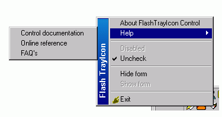



## Flash TrayIcon Control

### Description

Flash TrayIcon Control is an Active-X Control that alows you to easily build system tray enabled Application. Just drop this control on your form and customize the menu and other properties. 

Fully documented and with sample project, you'll learn easily how to use it. 

This time source code is included. 

Features: 

- system tray icon menu  

- 3 levels of submenus 

- menu items with icons 

- caption bar on main menu 

 Even it's a clean code there are side efects... and one of them is that you are going to like this very much. :))) 

Please send me feedback when you use my code and if I'm not asking too much: VOTE FOR ME. 

For further updates check the control's home page(http://cyprix.topcities.com)

System Requirements:

- Windows 98/2000

- Windows NT(>4)

Not tested on Windows Xp or Windows ME. Try it yourself and send me a comment.

10x
 
### More Info
 

             |
---                |---
**Submitted On**   |2002-01-16 15:28:48
**By**             |[©yprix](https://github.com/Planet-Source-Code/PSCIndex/blob/master/ByAuthor/yprix.md)
**Level**          |Advanced
**User Rating**    |4.4 (75 globes from 17 users)
**Compatibility**  |VB 6\.0
**Category**       |[OLE/ COM/ DCOM/ Active\-X](https://github.com/Planet-Source-Code/PSCIndex/blob/master/ByCategory/ole-com-dcom-active-x__1-29.md)
**World**          |[Visual Basic](https://github.com/Planet-Source-Code/PSCIndex/blob/master/ByWorld/visual-basic.md)
**Archive File**   |[Flash\_Tray492431172002\.zip](https://github.com/Planet-Source-Code/yprix-flash-trayicon-control__1-30878/archive/master.zip)

